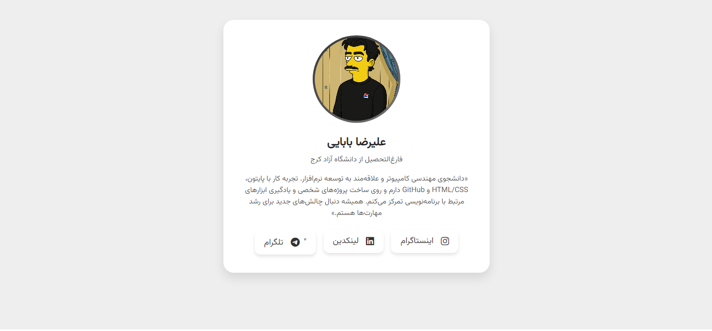

# Modern Card UI Component

A clean, responsive, and modern card UI built with pure HTML & CSS.  
Perfect for portfolios, dashboards, pricing cards, or any web project.

## Live Demo
https://alireza-babaee.github.io/card/

## Features
- Fully responsive (mobile ↔ desktop)
- Smooth hover effects
- Easy to customize
- No JavaScript required
- Lightweight & fast

## How to Use
1. Clone or download the repo
2. Open `index.html` in your browser
3. Copy the code and paste into your project
4. Edit `style.css` to match your style

## License
[MIT License](LICENSE) – free to use and modify

Made with love by [alireza-babaee](https://github.com/alireza-babaee)